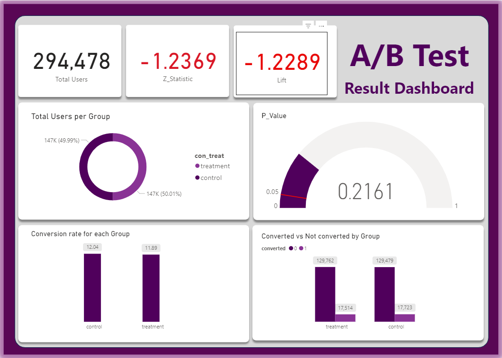

# 📊 A/B Test Analysis — E-Commerce Website Conversion Optimization



---

## 👤 Author

**Oyewole Jeremiah Oladayo**

[](https://www.linkedin.com/in/oyewole-jeremiah-9711a3231/)
[](mailto:oyewolejerry2016@gmail.com)

---

## 📌 Project Overview

This project analyzes the results of an **A/B test** conducted by an e-commerce company. The company developed a **new webpage** with the goal of increasing the number of users who **"convert"** — meaning users who decide to pay for the company's product.

The objective of this analysis is to help the company make a data-driven decision on whether to:
- ✅ **Implement the new page**
- ❌ **Keep the old page**
- ⏳ **Run the experiment longer**

---

## ❓ Problem Statement

> *"Does the new webpage lead to a statistically significant increase in user conversions compared to the old webpage?"*

The company invested resources in building a new webpage and needed evidence-based guidance before making a full rollout decision. A poorly performing page could cost the company revenue, while prematurely abandoning a good page could mean missed growth opportunities.

---

## 📁 Dataset

The dataset contains **294,478 records** of user interactions during the A/B test.

| Column | Description |
|--------|-------------|
| `id` | Unique identifier for each user |
| `time` | Timestamp of when the user visited the page |
| `con_treat` | Whether the user was in the **control** or **treatment** group |
| `page` | Which page the user saw (**old_page** or **new_page**) |
| `converted` | Whether the user converted — **1 = Yes**, **0 = No** |

### Dataset Summary

| Metric | Value |
|--------|-------|
| Total Users | 294,478 |
| Control Group (Old Page) | 147,202 users |
| Treatment Group (New Page) | 147,276 users |
| Missing Values | None |

---

## 🛠️ Tools Used

| Tool | Purpose |
|------|---------|
| **Python** | Data cleaning, analysis, statistical testing |
| **Pandas** | Data manipulation and exploration |
| **NumPy** | Numerical calculations |
| **Matplotlib / Seaborn** | Data visualization |
| **Statsmodels** | Z-test for proportions & Power Analysis |
| **Power BI** | Interactive dashboard |

---

## 🔍 Methodology

### 1. Data Exploration
- Loaded and inspected the dataset
- Checked for missing values (none found)
- Verified group balance between control and treatment

### 2. Conversion Rate Analysis
- Calculated overall conversion rate
- Calculated conversion rate per group
- Computed **lift** to measure relative performance

### 3. Hypothesis Testing

**Null Hypothesis (H₀):**
> There is no difference in conversion rates between the old page and the new page.

$$H_0: p_{treatment} = p_{control}$$

**Alternative Hypothesis (H₁):**
> There is a significant difference in conversion rates between the old page and the new page.

$$H_1: p_{treatment} \neq p_{control}$$

**Significance Level:** α = 0.05

### 4. Z-Test for Proportions

The Z-statistic was calculated as:

$$Z = \frac{p_{treatment} - p_{control}}{SE}$$

Where the pooled proportion is:

$$p_{pooled} = \frac{\text{total conversions}}{\text{total users}} = \frac{35,237}{294,478} = 0.1197$$

And the Standard Error (SE) is:

$$SE = \sqrt{p_{pooled} \times (1 - p_{pooled}) \times \left(\frac{1}{n_{treatment}} + \frac{1}{n_{control}}\right)}$$

The P-value was derived as:

$$P\text{-value} = 2 \times (1 - \Phi(|Z|))$$

### 5. Power Analysis

A power analysis was conducted to determine whether the sample size was sufficient to detect a meaningful difference of **2% improvement** in conversion rate.

| Parameter | Value |
|-----------|-------|
| Baseline Conversion Rate | 12.04% |
| Minimum Detectable Effect | 2% improvement |
| Desired Power | 80% |
| Significance Level | 0.05 |

---

## 📈 Results

### Conversion Rates

| Group | Conversions | Total Users | Conversion Rate |
|-------|-------------|-------------|----------------|
| Control (Old Page) | 17,723 | 147,202 | **12.04%** |
| Treatment (New Page) | 17,514 | 147,276 | **11.89%** |
| Overall | 35,237 | 294,478 | **11.97%** |

### Statistical Test Results

| Metric | Value |
|--------|-------|
| **Lift** | **-1.2289%** |
| **Z-Statistic** | **-1.2369** |
| **P-Value** | **0.2161** |
| Significance Level (α) | 0.05 |
| Z Critical Value (±) | 1.96 |

### Power Analysis Results

| Metric | Value |
|--------|-------|
| Required Sample Size per group | 289,171 |
| Actual Sample Size per group | 147,202 |
| Shortfall per group | 141,969 |
| Sample Adequacy | ⏳ Only 51% of required |

---

## 🔬 Interpretation

### Statistical Test
- The **P-value of 0.2161** is significantly greater than α = 0.05
- The **Z-statistic of -1.2369** falls within the acceptance region (|Z| < 1.96)
- Therefore we **fail to reject the null hypothesis**
- The negative lift of **-1.2289%** shows the new page slightly underperforms

### Power Analysis
- To reliably detect a **2% improvement** we need **289,171 users per group**
- We only collected **147,202 users per group** — just **51% of what is required**
- This means we risk a **Type II Error (False Negative)** — concluding there is no difference when one might actually exist

| Error Type | Meaning | Risk in Our Case |
|------------|---------|-----------------|
| Type I (False Positive) | Concluding pages differ when they don't | Low — P-value is high |
| **Type II (False Negative)** | **Concluding pages are same when they differ** | **High — sample too small** |

---

## ✅ Conclusion

$$P\text{-value} (0.2161) > \alpha (0.05) \therefore \text{ Fail to Reject } H_0$$

> *"While the current results show no statistically significant difference between the old and new page, the sample size of 147,202 per group is only 51% of the required 289,171 users needed to reliably detect a meaningful 2% improvement. The experiment should be run longer before making a final decision."*

### Final Recommendation to the Company

| Question | Answer | Reason |
|----------|--------|--------|
| Launch new page? | ❌ Not yet | No significant improvement detected |
| Keep old page? | ⏳ Temporarily | Old page currently performs better |
| Run experiment longer? | ✅ **Yes** | Need 289,171 users per group (currently at 51%) |

### Action Plan
1. ⏳ **Continue the experiment** until at least **289,171 users per group** are reached
2. 📊 **Re-run the statistical test** with the larger sample
3. 🔁 **If still not significant** — keep the old page and redesign the new one
4. ✅ **If significant** — make a confident data-driven launch decision

---

## 📊 Dashboard

The Power BI dashboard below summarizes all key findings interactively:


**Dashboard includes:**
- Total users and group balance
- Conversion rates per group
- P-value gauge vs significance threshold (0.05)
- Converted vs not converted per group
- Z-statistic and lift KPI cards

---

## 📂 Project Structure

```
ab-test-analysis/
│
├── data/
│   ├── ab_test_data.csv          # Original dataset
│   └── ab_test_results.csv       # Statistical results
│
├── notebook/
│   └── ab_test_analysis.ipynb    # Jupyter Notebook
│
├── dashboard/
│   └── ab_test_dashboard.pbix    # Power BI Dashboard
│
├── images/
│   └── dashboard.png             # Dashboard screenshot
│
└── README.md                     # Project documentation
```

---

## 📬 Contact

Feel free to reach out if you have any questions or feedback about this project!

**Oyewole Jeremiah Oladayo**

| Platform | Link |
|----------|------|
| 💼 LinkedIn | [oyewole-jeremiah-9711a3231](https://www.linkedin.com/in/oyewole-jeremiah-9711a3231/) |
| 📧 Email | [oyewolejerry2016@gmail.com](mailto:oyewolejerry2016@gmail.com) |

---

*This project was completed as part of a data analysis portfolio. All analysis was performed using Python and Power BI.*
